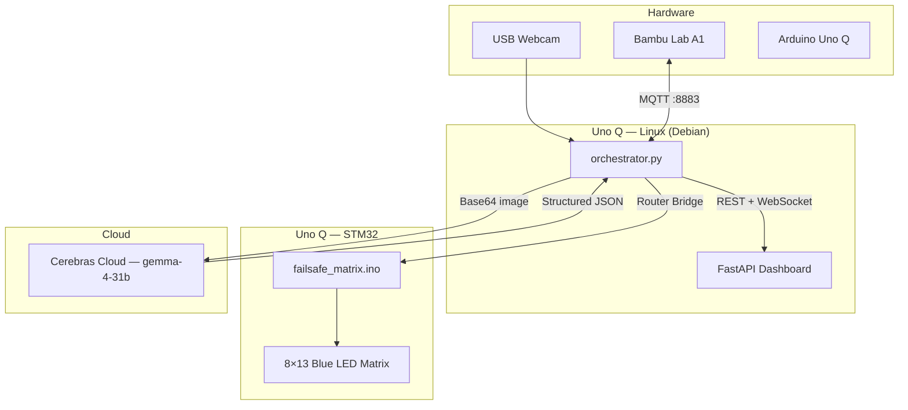

# Vision-Loop FailSafe

A closed-loop physical monitoring system for 3D printing, built for the **Gemma 4 × Cerebras Hackathon**. FailSafe watches a live print through a USB webcam, analyzes each frame with **Gemma 4 31B** on **Cerebras Cloud** in under a second, and can automatically pause the printer when a critical failure is detected.

The system runs on an **Arduino Uno Q** (Linux MPU + STM32 MCU), talks to a **Bambu Lab A1** over local MQTT, and surfaces everything in a real-time web dashboard.

---

## What it does

Every 4 seconds, FailSafe:

1. Captures a webcam frame of the print bed
2. Sends it to Cerebras for multimodal vision analysis
3. Updates a live dashboard with the image, AI reasoning, and latency metrics
4. Drives the Uno Q's onboard blue LED matrix to reflect system state
5. If a **critical failure** is detected (spaghetti, detached print, collision, etc.) — pauses the printer via MQTT and halts the monitoring loop

This keeps inference well under Cerebras's rate limits (~15 requests/min at a 4s interval vs. a 100 RPM ceiling) while still reacting fast enough to catch real print disasters.

---

## Architecture



| Layer | Role |
|-------|------|
| **Edge agent** | Camera capture, MQTT printer control, Cerebras inference, MCU commands |
| **Web app** | Live dashboard — frame feed, status, telemetry, AI log, latency metrics |
| **Firmware** | Onboard LED matrix status display driven by text commands from Linux |

---

## Hardware

| Component | Purpose |
|-----------|---------|
| **Arduino Uno Q** | Runs the Python orchestrator on Linux; MCU handles the LED matrix |
| **USB webcam** | Live view of the print bed (`/dev/video0`) |
| **Bambu Lab A1** | Target printer — telemetry and pause commands over local MQTT |

---

## Project structure

```
failsafe-system/
├── firmware/
│   └── failsafe_matrix/          # Arduino sketch for Uno Q MCU
│       └── failsafe_matrix.ino
├── edge_agent/                   # Python orchestrator (runs on Uno Q Linux)
│   ├── orchestrator.py           # Main control loop
│   ├── camera_handler.py         # OpenCV capture + Base64 encoding
│   ├── cerebras_client.py        # Gemma 4 vision + structured outputs
│   ├── printer_client.py         # Bambu MQTT client
│   ├── mcu_serial.py             # Non-blocking MCU command bridge
│   ├── web_client.py             # Pushes state to dashboard
│   └── config.py                 # Environment-based settings
└── web_app/                      # Monitoring dashboard
    ├── app.py                    # FastAPI backend + WebSocket
    └── static/                   # Tailwind frontend
```

---

## Quick start

### 1. Flash the firmware

Upload `failsafe-system/firmware/failsafe_matrix/failsafe_matrix.ino` to the Uno Q MCU using **Arduino App Lab** or the Arduino IDE.

The sketch listens for status commands and drives the onboard LED matrix:

| Command | LED behavior |
|---------|--------------|
| `STATUS_OK` | Static checkmark — print looks safe |
| `STATUS_THINKING` | Spinning perimeter animation — inference in progress |
| `STATUS_FAIL` | Flashing X — critical failure detected |

> On the Uno Q, Linux sends these commands through the **arduino-router** bridge (`/var/run/arduino-router.sock`), not by opening `/dev/ttyHS1` directly.

### 2. Install dependencies

**Dashboard (MPU):**
```bash
cd failsafe-system/web_app
pip install -r requirements.txt
```

**Edge agent (MPU):**
```bash
cd failsafe-system/edge_agent
pip install -r requirements.txt
```

### 3. Configure environment

```bash
export CEREBRAS_API_KEY="your-cerebras-api-key"
export BAMBU_SERIAL_NUMBER="your-printer-serial"
export BAMBU_ACCESS_CODE="your-lan-access-code"
export BAMBU_BROKER_HOST="192.168.x.x"        # printer IP on LAN
export WEB_APP_URL="http://127.0.0.1:8080"
```

| Variable | Default | Description |
|----------|---------|-------------|
| `CAMERA_DEVICE` | `/dev/video0` | Webcam device path |
| `CAMERA_WIDTH` / `CAMERA_HEIGHT` | `640` / `480` | Frame size sent to Cerebras |
| `BAMBU_BROKER_PORT` | `8883` | MQTT over TLS |
| `BAMBU_USERNAME` | `bblp` | Bambu LAN MQTT username |
| `CEREBRAS_MODEL` | `gemma-4-31b` | Vision model |
| `LOOP_INTERVAL_SECONDS` | `4.0` | Seconds between inference cycles |
| `ARDUINO_ROUTER_SOCKET` | `/var/run/arduino-router.sock` | Uno Q MCU bridge |

### 4. Run

**Terminal 1 — start the dashboard:**
```bash
cd failsafe-system/web_app
python app.py
```

**Terminal 2 — start monitoring:**
```bash
cd failsafe-system/edge_agent
python orchestrator.py
```

Open **http://\<uno-q-ip\>:8080** in a browser.

---

## Dashboard

The web UI is a single-page command center showing:

- **Live viewport** — most recent frame analyzed by Gemma 4
- **System status** — `RUNNING SAFELY` (green) or `EMERGENCY HALT` (red)
- **Print telemetry** — live progress bar from Bambu MQTT
- **Cerebras performance** — TTFT, tokens/sec, completion time, end-to-end latency
- **AI inference log** — rolling stream of Gemma 4 analysis text

Updates stream over WebSocket; the orchestrator pushes state via `POST /api/state`.

---

## Critical failure flow

When Cerebras returns `print_status: "critical_failure"`:

1. MCU LED matrix switches to flashing **X** (`STATUS_FAIL`)
2. Orchestrator publishes a MQTT pause command to the A1
3. End-to-end halt latency is logged
4. Dashboard status changes to **EMERGENCY HALT**
5. The monitoring loop stops

Structured output schema enforced on every inference:

```json
{
  "print_status": "nominal | critical_failure",
  "issue_detected": true,
  "analysis": "Short description of what the model sees on the print bed."
}
```

---

## Tech stack

| Area | Tools |
|------|-------|
| Vision AI | Cerebras Cloud — `gemma-4-31b`, strict JSON schema outputs |
| Edge runtime | Python 3, OpenCV, paho-mqtt, httpx |
| Printer integration | Bambu LAN MQTT (TLS, port 8883) |
| MCU | Arduino C++ — `Arduino_LED_Matrix`, `Arduino_RouterBridge` |
| Dashboard | FastAPI, WebSocket, Tailwind CSS, vanilla JS |

---

## Hackathon context

Built in 24 hours for the **Gemma 4 Cerebras Hackathon** — demonstrating wafer-scale inference speed applied to a real physical safety loop: see → reason → act, fast enough to matter on a live 3D print.
